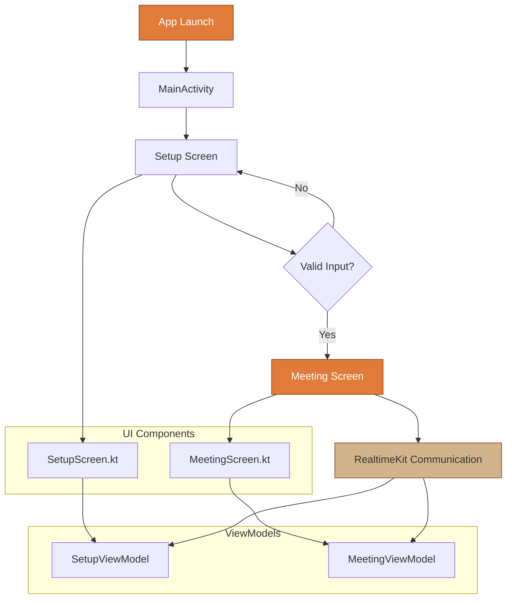

# Sample App

A modern Android application built with Jetpack Compose that demonstrates real-time communication capabilities using [Cloudflare's RealtimeKit](https://realtime.cloudflare.com/).

## 📋 Prerequisites

Before running this project, ensure you have:

- **Android Studio**: Latest stable version (Hedgehog or newer recommended)
- **JDK**: Java 21 or higher
- **Android SDK**: API level 26 (minimum) to 35 (target)
- **Gradle**: 8.0 or higher (handled by Gradle wrapper)

## 🛠️ Setup & Installation

1. Clone the repo
2. Create [a RealtimeKit meeting](https://docs.realtime.cloudflare.com/api?v=v2#/operations/create_meeting)
3. Add a participant [to generate token](https://docs.realtime.cloudflare.com/api?v=v2#/operations/add_participant)
4. Open in Android Studio, Run the app and paste the token
5. Follow instructions in ../server-demo/ 

## 📁 Project Structure

```
app/
├── src/main/
│   ├── java/com/cloudflare/anthropic_sample/
│   │   ├── MainActivity.kt
│   │   ├── ui/
│   │   │   ├── FlatButton.kt
│   │   │   ├── setup/
│   │   │   │   ├── SetupScreen.kt
│   │   │   │   └── SetupViewModel.kt
│   │   │   ├── meeting/
│   │   │   │   ├── MeetingScreen.kt
│   │   │   │   └── MeetingViewModel.kt
│   │   │   └── theme/
│   │   │       ├── Color.kt
│   │   │       ├── Theme.kt
│   │   │       └── Type.kt
│   │   └── utils/
│   ├── res/
│   └── AndroidManifest.xml
├── build.gradle.kts
└── proguard-rules.pro
```

## 🔄 App Flow Diagram



## 📱 Supported Android Versions

- **Minimum**: Android 8.0 (API 26)
- **Target**: Android 14 (API 35)
- **Recommended**: Android 10+ for best experience
